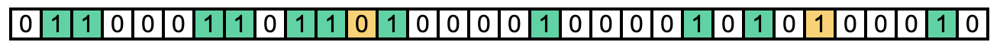

# Bloom

  

  

## About
Bloom is a simple single-page application (SPA) that explains what Bloom filters are and how they work.

The application contains both informative educational content as well as an interactive visualization of a Bloom filter in action.

See for yourself! Bloom is currently deployed to GitHub pages at the link below:

[ellisandrews.github.io/bloom/](https://ellisandrews.github.io/bloom/)
